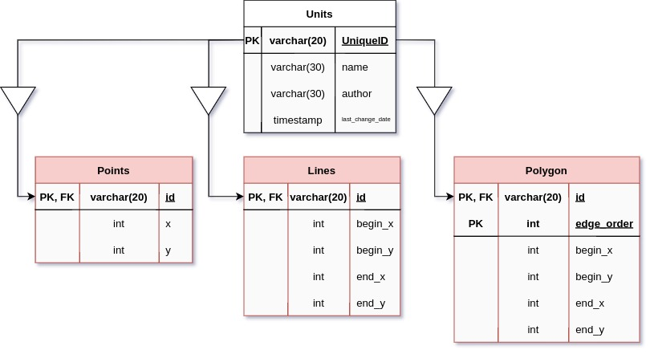

= C. Министерство бесполезных исследований

Министерство бесполезных исследований Яндекса (да-да, есть и такое) запустило исследование неосвоенных территорий Сибири. Алгоритмами ручного сопоставления удалось разметить все объекты на исследуемом участке. Объекты разделены на три класса:

. Point — точка. Обозначает растущие деревья и высокие кусты.
. Line — отрезок. Обозначает поваленные деревья и спрямлённую трассировку путей зверей.
. Polygon — Полый полигон. Обозначает границы болот.

Исследователи хотят определить статус некоторых из гипотез. Для этого им необходимо научиться отвечать на вопрос "Какие объекты видны из прямоугольника запроса"?

Объект считается видимым из прямоугольника запроса, если хотя бы одна точка объекта лежит внутри или на границах прямоугольника запроса (за исключением внутренних точек полигонов). Гарантируется, что прямоугольник запроса не является вырожденным, то есть его площадь ненулевая.

Помогите исследователям и напишите так необходимый для их работы скрипт!

== Формат ввода

Все расклассифицированные объекты сложены в базу данных со следующей схемой:

Для хранения данных используется postgresql 10.6.1 x64.

DDL для базы данных, представленной выше, Вы можете найти https://contest.s3.yandex.net/init_ddl.sql[здесь].

Значения координат всех объектов также целые и по модулю не превосходят 10^4^

Поле Polygons.edge_order является порядковым номером ребра полигона с номером Polygons.id. Нумерация рёбер является последовательностью целых чисел, которая начинается с 0

Значения границ прямоугольника запроса задаются в плейсхолдерах _X_LEFT_, _X_RIGHT_, _Y_BOTTOM_, _Y_TOP_ — левая, правая, нижняя и верхняя граница прямоугольника запроса соответственно. На этапе запуска Вашего скрипта в эти плейсхолдеры будут подставлены конкретные значения. Подставляемые значения являются целыми числами cо следующими ограничениями:

. −10^4^ ≤ _X_LEFT_ < _X_RIGHT_ ≤ 10^4^
. −10^4^ ≤ _Y_BOTTOM_ < _Y_TOP_ ≤ 10^4^

== Формат вывода

В этой задаче жюри ожидает от Вас скрипт на языке SQL, реализует запрос к базе данных и вернёт id всех объектов, наблюдаемых из прямоугольника запроса пользователя.
